   
  <i>Let's build intelligent, useful software.</i>

  
  
  

---

### About

CSE undergraduate at SUIIT, Burla, building software full-stack — from AI-integrated backends to interfaces designed in Figma. Software Engineer Intern at UnifyApps (API integrations, backend testing); Technical Lead at E-Cell SUIIT; Secretary, AWS Cloud Club. Two hackathon wins: an AI health assistant and an AI-driven education platform.

Currently working with agentic AI tooling — Claude Code, Codex, Ollama — alongside a standard full-stack toolkit spanning Node.js, React/Next.js, and SQL/NoSQL databases.

---

### Stack

#### Languages
    

#### Frontend
  

#### Backend & Databases
       

#### AI & Agentic Tools
   

#### DevOps & Tools
       

#### Design
  

---

### Projects

<table>
  <tr>
    <td width="50%" valign="top">
      <b><a href="https://github.com/deba608/self_print">self_print</a></b> · <a href="https://selfprint-six.vercel.app">live</a> 
      Self-service print ordering web app.
    </td>
    <td width="50%" valign="top">
      <b><a href="https://github.com/deba608/IPO_Desk">IPO_Desk</a></b> · <a href="https://ipo-desk-six.vercel.app">live</a> 
      IPO tracking and allotment dashboard.
    </td>
  </tr>
  <tr>
    <td width="50%" valign="top">
      <b><a href="https://github.com/deba608/url_shortner">url_shortner</a></b> · <a href="https://shortly-devv.vercel.app">live</a> 
      Minimal URL shortening service.
    </td>
    <td width="50%" valign="top">
      <b><a href="https://github.com/deba608/store-locator">store-locator</a></b> 
      Location-based store finder built in TypeScript.
    </td>
  </tr>
</table>

---

### Activity

  

